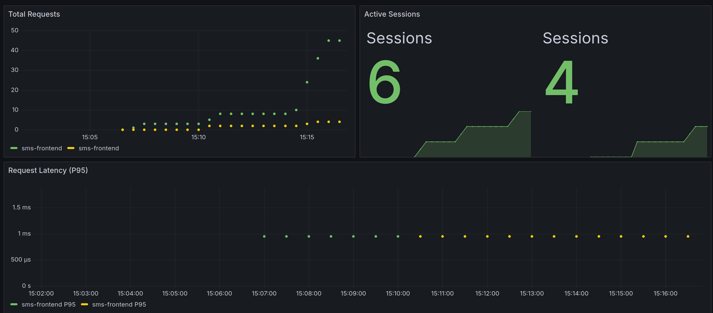

# Continuous Experimenation

## Feature Description

A new version of the application introduces a UI change, where the send button is now displayed in green. The original version uses the existing button color.

## Hypothesis

Changing the color of the send button to green does not negatively impact the application performance or user behaviour to the original version of the app.

## Experiment Setup

Two versions of the appolication and model service are deployed:

- app-v1 (original color)
- app-v2 (green colored button)
- model-service-v1
- model-service-v2

Traffic is split using Istio:
- 90% of requests are routed to v1 (Group A)
- 10% of requests are routed to v2 (Group B)

## Metrics

The following metrics are collected using Prometheus:
- `app_active_sessions`: active sessions of that version of the app
- `app_request_latency_seconds`: request latency histogram
- `app_requests_total`: total number of request to that version of the app

## Decision Process

When comparing the metrics using Prometheus and Grafana we need to determine if the latency and the number of active sessions for v2 and for v1 remain comparable. If they do, then it can be concluded that the experiment (what Group B sees), was successful and can be rolled out. If they do not, and user activity and/or performance is hit from the experiment, then we can simply conclude that the experiment was not successful and we can go back to v1.

## Results 

No significant difference in latency or active session was observed betwen v1 and v2 during the experiment. Based on the observations, the new version can be safely rolled out.

## Visualization

Note: Green = v1, Yellow = v2