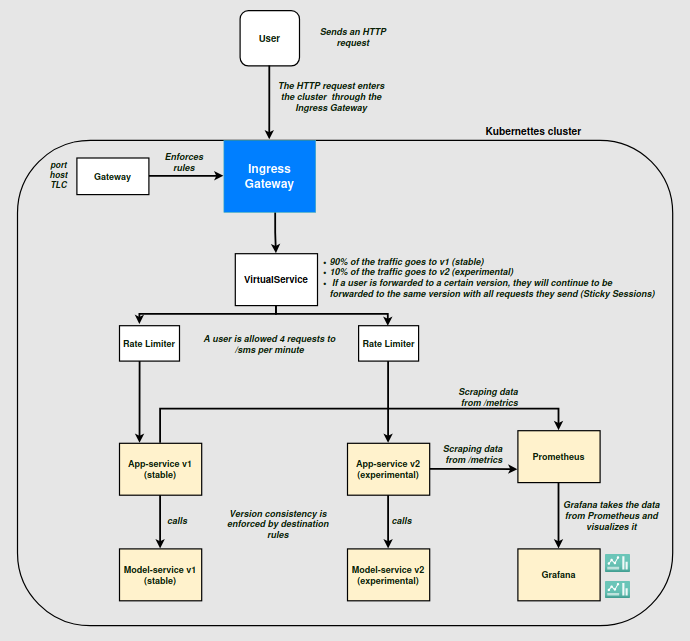

# Deployment Overview
This file provides a deployment overview of the final deployment of the SMS Classification application. It aims to clarify the used setup to a new developer/reader.  
The reader will find information about the system context, deployed components, deployment architecture (diagram), access to the application, an example request flow, canary releases, rate limiting, and finally observability and metrics

## System context

The system is deployed into an already existing Kubernetes cluster. The cluster provides the following:
- A **Kubernetes control pane and worker nodes**
- An **Istio service mesh** instalation
- An **Istio IngressGateway**

The application is installed using a **Helm chart**. All Kubernetes and Istio resources related to the application are installed through this Helm chart. The Istio IngressGateway is not part of the Helm chart and is an external dependency.

## Deployed Components

### Application

The application consists of two services - frontend (**app**) and backend (**model-service**). They are both deployed in two versions.

| Service | Version | Purpose |
| :--- | :----: | ---: |
| **app (frontend)** | v1 (stable) / v2 (experimental) | Exposes REST API used by the frontend; delegates classification tasks to the backend |
| **model-service (backend)** | v1 (stable) / v2 (experimental) | Exposes REST API for SMS classification |

### Istio Traffic Management 

The following **Istio** resources control the traffic flow between user and services:

- **IngressGateway**
    - The **entry point** into the cluster
    - Receives **HTTP requests** from users on a configured hostname and port

- **Gateway**
    - Configured via **Helm**
    - Used to bind the application to the externally provided **IngressGateway**
    - Sets hostnames and ports used to access the application

- **VirtualService**
    - Defines the **HTTP routing rules**
    - Implements **canary routing** to split traffic between v1 (stable) and v2 (experimental) of **app-service**; 90% of requests go to v1, 10% got to v2.

- **DestinationRules**
    - Ensures version consistency for a request
    - **app-service v1** ==> **model-service v1**
    - **app-service v2** ==> **model-service v2**

### Observability
The observability stack includes **Prometheus** and **Grafana**. 

| Component | Role |
| :--- | :----: |
| **Prometheus** | Deployed as part of the **Helm** chart; scrapes application metrics from the frontend |
| **Grafana** | Deployed alongside **Prometheus**; provides a **dashboard** for monitoring and experimental evaluation |
| **ServiceMonitor** | Ties **Prometheus** to the **Kubernetes Services** to automatically collect metrics exposed on */metrics* |

Metrics include **Counters**, **Gauges**, and **Histograms**

## Deployment Architecture (Conceptual Diagram)

## Access to Application

The application is accessed through an **Istio IngressGateway**, using an HTTP endpoint

- **Hostname**: Configured through Helm values (*app.stable.example.com*)

- **Port**: 80

- **Protocol**: HTTP

The **Istio Gatweay** binds the hostname to the **IngressGateway**. All incoming traffics goes through the **VirtualService** to be routed to the two different deployed service versions.

## Request Flow
An example request flow:
1. A user sends an **HTTP request** to the hostname (e.g. `app.stable.example.com`)
2. The request goes to the cluster through the **IngressGateway** (hostname and port are binded to the **IngressGateway** by the **Istio Gateway**)
3. The request is accepted and forwarded to **VirtualService**
4. **VirtualService** assignes the request to either **app-service** v1 (stable) or v2 (experimental) with 90/10 routing rules
5. The **app** processes the request and calls the corresponding version of **model-service**
6. **model-service** performs the classification task and returns the result
7. The result is propagated back to the user following the same steps
8. App metrics are scraped by **Prometheus** and visualized with **Grafana**

## Canary Releases

Canary releases are implemented using **Istio wighted routing**:
- 90% of requests are routed to **app-service** v1 (stable)
- 10% of requests are routed to **app-service** v2 (experimental)
- **Sticky sessions** are implemented to ensure that when a user sends multiple request they all go to the same version

To ensure consistency during experimentation, destination rules only allow v1 of **app-service** to communicate with v1 of **model-service** and, respectively, v2 of **app-service** to communicate only with v2 of **model-service**.

## Observability and Metrics

The **app-service** exposes Prometheus metrics on */metrics* that capture user behaviour and system performance. These include counters, gauges and histograms.

**Prometheus** scrapes the metrics from the frontend and stores them as time-series data. **Grafana** takes the data from Prometheus and visualizes it in the form of dashboards, which enables easy monitoring and comparisons between the stable and experimental versions.

## Links to repositories
- **model-service**: https://github.com/doda25-team9/model-service
- **app**: https://github.com/doda25-team9/app
- **operation (current)** - https://github.com/doda25-team9/operation
- **lib-version**: https://github.com/doda25-team9/lib-version